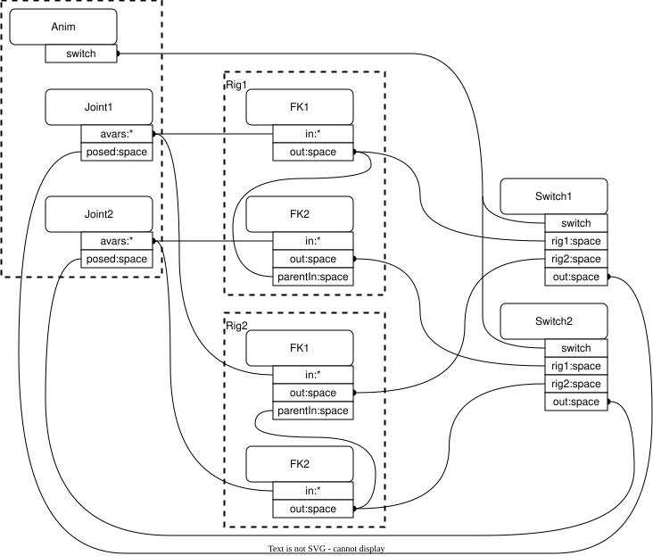

# OpenExec Invertible Rigs Example

This directory contains code and assets that demonstrate how invertible rigs can
be used to pose model skeletons--and particularly how they are used in the
context of animation authoring workflows, where invertibility is important. This
document describes an example rig and a key authoring workflow that highlights
the benefits of invertible rigs. For more additional information, see the
[execIr library documentation](#page_ExecIr_readme).

> [!warning]
> The example code and assets in this library are built using schemas and APIs
> that are limited in functionality, subject to change, and not yet ready for
> production use.

## Example Invertible Rig

The test `testSwitchCompensation` includes `waddlerRig.usda` (see **Example
Files**, below), which contains an example invertible rig. The rig consists of
two `ExecIrJointScope` prims; two sub-rigs, each of which contains two
`ExecIrFkController` prims; and two `ExecIrSwitchController` prims that control
which sub-rig is active at any given time.



The above diagram shows the structure of the "waddler" rig. This is a toy
version of a kind of rig that is used in production to animate the overall
position and orientation of a model. The key feature of the waddler is that
there are two pivots that it can rotate about, only one of which is active at a
given time. To represent this in terms of invertible rigs, there are two
sub-rigs and a **switch avar** that feeds switch controllers, which enable the
selected rig based on the switch avar's value.

Note that the example rig isn't wired up to pose any geometry; its output is the
space (i.e., the transform matrix) produced by the attribute `posed:space` on
the joint scope `Joint1`. To pose geometry, this attribute would feed (e.g., via
attribute connections) other computations that would transform geometry
according to the pose produced by the rig.

## Switch Compensation

The ability to switch among sub-rigs presents a challenge for authoring
animation because changing the value of the switch avar (which can happen as we
move from one frame of animation to the next) will, in general, cause a
discontinuous change in the pose produced by the rig. In order to generate
continuous motion as we change from selecting rig A to selecting rig B, we need
to find the set of input avar values for rig B that produce the same pose that
is produced by rig A before the switch. This is where we take advantage of the
fact that the rigs are invertible: By invoking
[inversion](#section_ExecIr_Inversion), we can compute the input avar values
that satisfy this requirement (assuming that rig B can produce the desired
pose). The process of computing and authoring values that produce continuous
motion when changing the value of a switch avar is called **switch
compensation**.

Switch compensation works as follows:
1. Invoke the FK controller **forward computations** to compute the joint spaces
   produced by rig A. The **joint spaces** are the transform matrices that
   represent the overall pose produced by the rig. This is done using
   `ExecUsdSystem::Compute()` to compute the values of the `posed:space`
   attributes before the switch.
2. Invoke the FK controller **inverse computations** to compute the input avar
   values that cause rig B to produce the same joint space values. This is done
   using `ExecUsdSystem::ComputeWithOverrides()`. The overrides passed to this
   function give the switch avar value that selects rig B and the desired joint
   space values. The `ExecUsdRequest` passed to this function contains value
   keys requesting the `computeDesiredValue` computation on each of the input
   avars.
3. **Break down** all input avars, including the switch avar, by taking their
   current values at the switch time and writing these values to the attributes
   at the switch time's pre-time (see `UsdTimeCode::PreTime()`). This will
   prevent the values we're about to author from affecting animation before the
   current time.
4. Author the resulting avar values, including the new switch avar value, at the
   switch time.

The authoring code in this library provides an initial implementation of switch
compensation in InvertibleRigsExample_Authoring::CompensateSwitch(). This code
also includes an initial implementation of the breakdown operation in
InvertibleRigsExample_Authoring::BreakdownInputAvars().

## Example Files

- The file `assets/waddlerRig.usda` contains the example rig discussed above.
- The file `assets/shot.usda` references the waddler rig into a small scene.
- The test code in
  `irExampleAuthoringCode/testenv/testSwitchCompensation.py` (which
  contains copies of these same assets) illustrates how switch compensation can
  be used to programmatically produce continuous animation.
- When the test runs, it produces `result.usda`, which contains the resulting
  animation.

## Building and Running the Example Plugin

> [!Note]
> Note that we use bash shell syntax here; other shells may require different 
> syntax.

First, make sure you have properly built and installed OpenUSD with usdview and 
examples by following the instructions 
[here](https://github.com/PixarAnimationStudios/OpenUSD#getting-and-building-the-code).

1. Build OpenUSD with the `--examples` option.
    ```
    python /path/to/OpenUSD/build_scripts/build_usd.py --examples [other options ...] /path/to/my_usd_install_dir
    ```

   Upon completion, you should receive a message similar to the following:
    ```
    Success! To use USD, please ensure that you have:

       The following in your PYTHONPATH environment variable:
       /path/to/my_usd_install_dir/lib/python3.9/site-packages

       The following in your PATH environment variable:
       /path/to/my_usd_install_dir/bin
    ```
      
2. Update your environment with these paths accordingly.
    ```
    export PYTHONPATH=$PYTHONPATH:/path/to/my_usd_install_dir/lib/python3.9/site-packages
    export PATH=$PATH:/path/to/my_usd_install_dir/bin
    ```

Now, set up the environment to enable loading of the usdview plugin for the 
Invertible Rigs example.

1. In order for usdview to find plugins not located in the default search 
   path, the location of the plugin must be added to the 
   [PXR_PLUGINPATH_NAME](https://openusd.org/release/tut_usdview_plugin.html) 
   environment variable. This example's plugin is located in the 
   irExampleUsdviewPlugin directory within the OpenUSD *source* 
   tree:
    ```
    export PXR_PLUGINPATH_NAME=$PXR_PLUGINPATH_NAME:/path/to/OpenUSD/extras/exec/examples/irExample/irExampleUsdviewPlugin
    ```
   
2. This example relies on the visualization of schemas with registered 
   computations. To this end, a new, experimental "stage" scene index was 
   implemented in order for Hydra to consume values from OpenExec's execution 
   network and properly update them. To activate this scene index, set 
   the environment variable `USDIMAGINGGL_ENGINE_ENABLE_EXEC_SCENE_INDEX` to 1. 
    ```
    export USDIMAGINGGL_ENGINE_ENABLE_EXEC_SCENE_INDEX=1
    ```
   
3. Finally, the plugin is gated by the environment variable
   `USDVIEW_ENABLE_OPENEXEC_DEMO_PLUGIN`, so this must be set to 1. 
    ```
    export USDVIEW_ENABLE_OPENEXEC_DEMO_PLUGIN=1
    ```

We can at last launch usdview using the `shot.usda` file in the example's 
`assets` directory.
```
usdview /path/to/OpenUSD/extras/exec/examples/irExample/assets/shot.usda
```

If everything has been set up correctly, usdview should now have an 'OpenExec' 
menu with an 'Invertible Rig Demo' item. Clicking on this item will bring up the 
'OpenExec: Invertible Rig Demo' dialog.

### Troubleshooting

- Make sure to use absolute paths when setting your environment variables.
- Make sure you are running the proper usdview binary, especially if you have 
  multiple OpenUSD installations present. The `which` command on Linux/macOS and 
  the `where` command on Windows can help identify the true path to the binary.
- An incorrect `PYTHONPATH` may cause usdview not to find the required Python 
  modules, resulting in a `ModuleNotFoundError`. Double check that this 
  directory exists underneath the install directory, and that it contains the
  `pxr` subdirectory.
